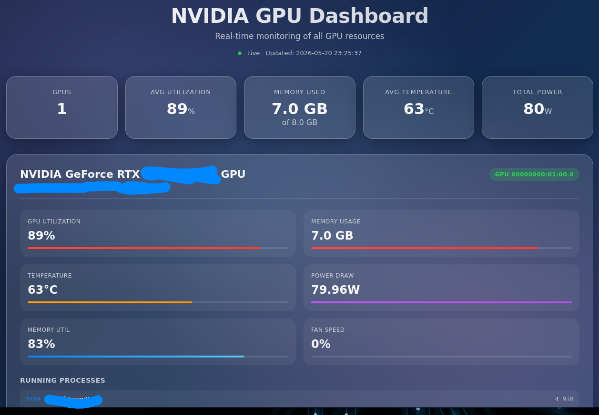

Ce projet vous permet de télécharger un dashboard permettant de voir la consommation de carte graphique NVIDIA que vous utilisez.
il vous permet de suivres la memoire GPU utilisé, la temperature de votre equipement et la consommation en watt produite par la carte graphique.

Pour lancer le programme :

bash run.sh
